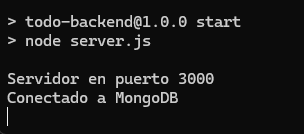
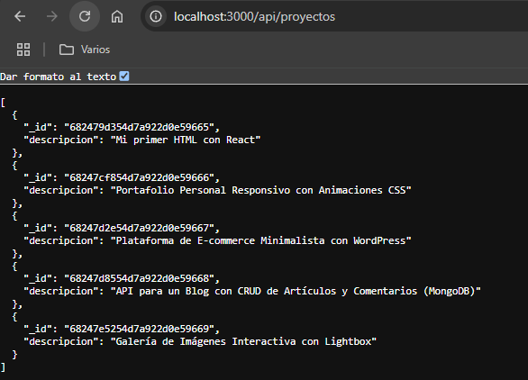

# Crear la base de datos y colección proyectos en el cluster de Mongo DB
# Cargar los datos en la colección 

# Inicializar el server con npm star

# Verificar los datos en http://localhost:3000/api/proyectos

#Subir a GitHub

#Desplegar en Render
